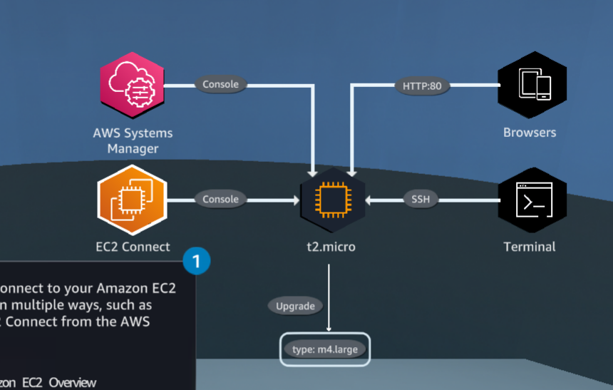
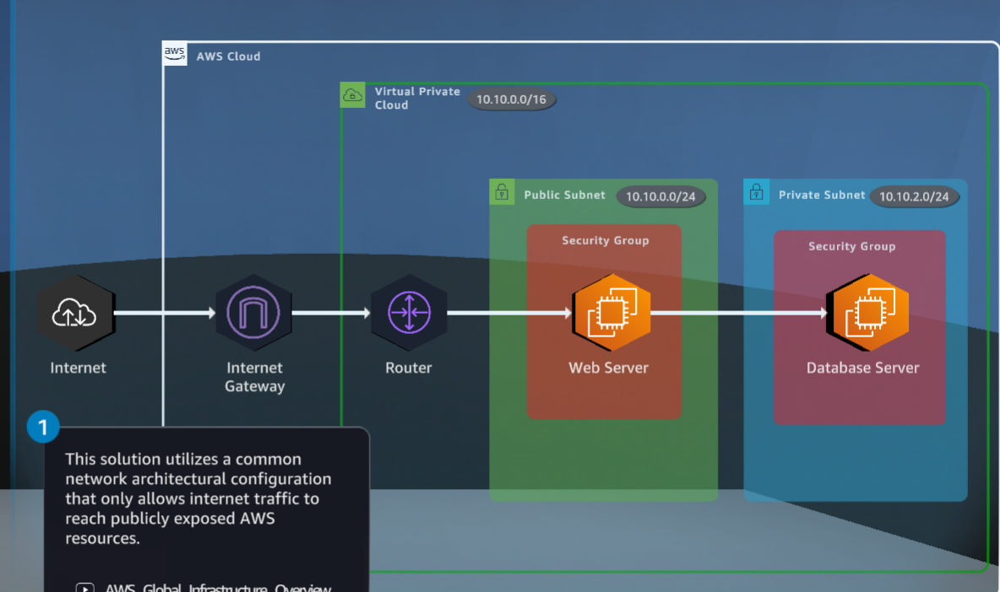
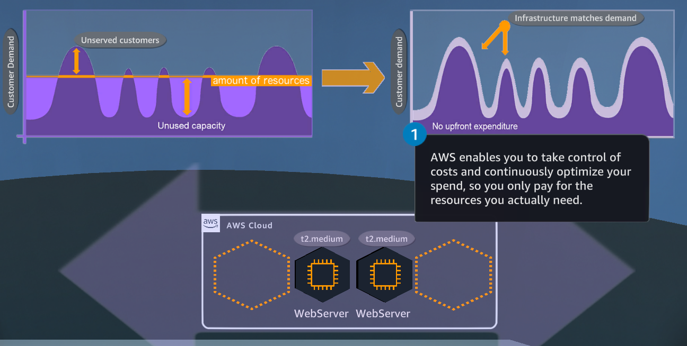
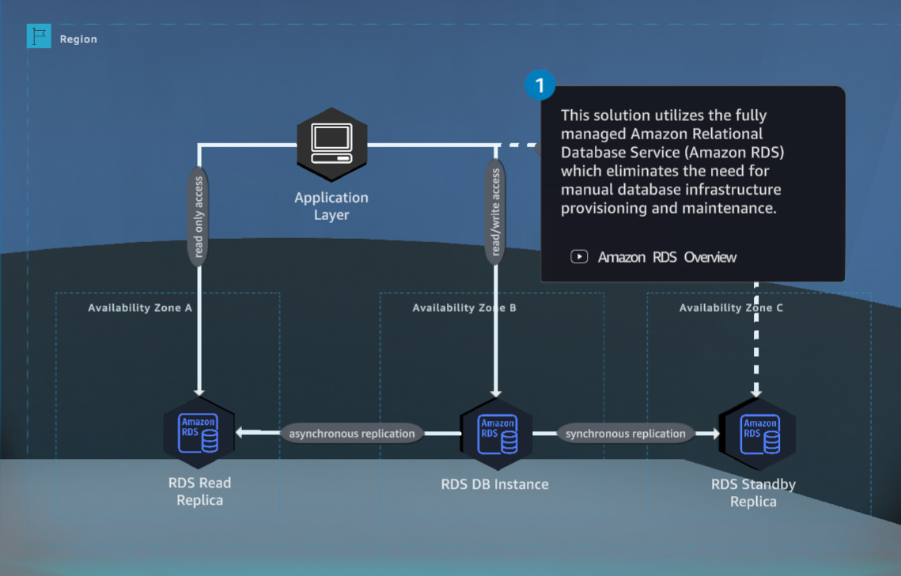
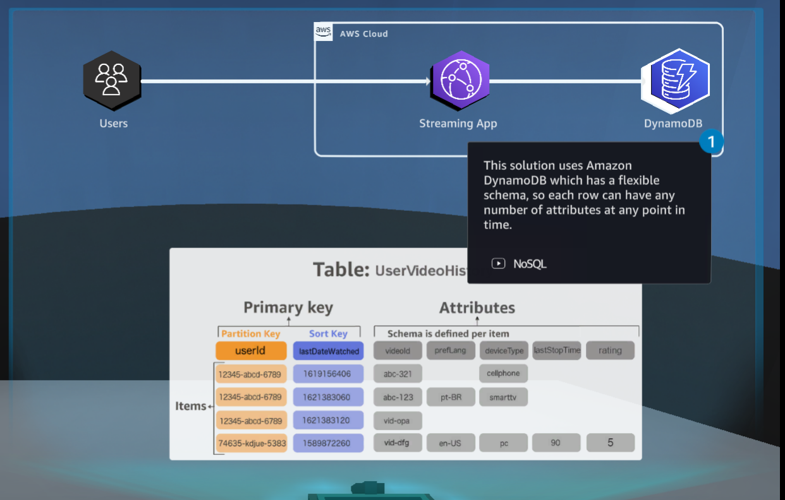
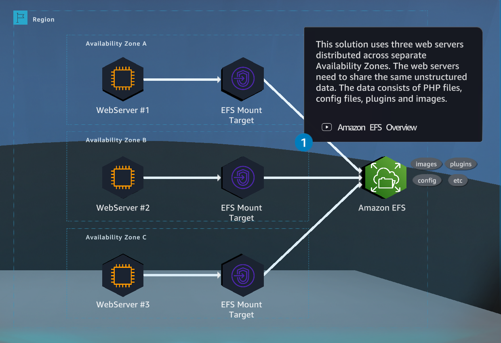
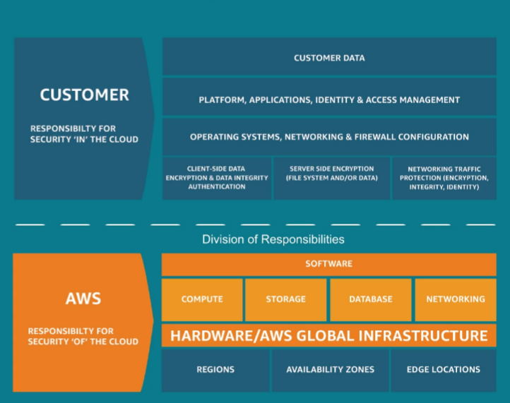
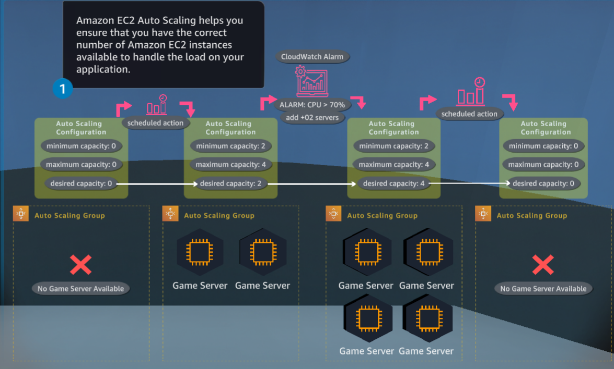
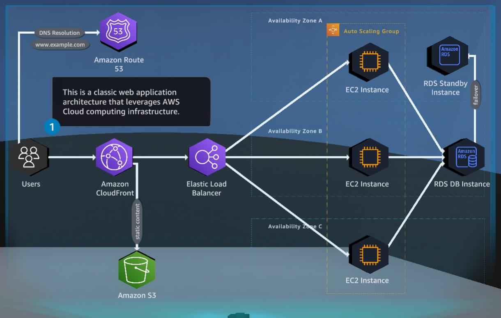

# CloudQuest

## Cloud COmputing Essentials

- Cloud computing on AWS provides access to technology services like compute, power, storage, and databases.
- Resources are available on demand
- You only pay for what you use
- Can deploy a server in minutes
- Fraction of the cost of traditional servers


## Static webpage hosting on S3

- Each day a file with the hourly wave size prediction is sent to the island IT department
- Visiting the web portal triggers a get request to waves.html page hosted on S3 that displays forecast data


### S3 Overview

- Object Storage service
- Object
  - Data
  - Metadata
- Bucket - stoarage space
- Scalability
- Availability
- Security
- Performance
- Website
- Mobile
- Enterprice
- Backup
- Restore
- Fluctuating demands
- 11 9s durability
- Security
- Audit capabilities
- Encryption features
- Access management tools
- Block public access
- PCI-DSS |HIPPA/HITECH | RedRAMP | Fisma
- Most supported cloud storage network
- Amazon Partner Network
  - Migration partners
  - Storage partners
    - Archive / Restore / Disaster
  - AWS Marketplace

### S3 MOre Features

- S3 Standard -msec
- Intelligent-Tiering -msec
- Standard-IA -msec
- One Zone - IS -msec
- Glacier Instant -msec cheapest immediate
- Glacier Flexible -mins / 5-12H
- Glacier Deep Archive -12-48H
- Management tools for granular data control
- S3 Storage Class Analysis - find lowest cost storage based on access patterns
- CRR - Cross Region Replication - or within region
- Object Lock - retention period
- Inventory - list encryption status
- API requests
- Works with Lambda
  - Activities
  - Alerts
  - Automate workflows
- Big Data Analytics - directly on data stored in S3 without copying or moving
- Compatible with Athena and Redshift Spectrum
  - Run SQL queries against data at rest in S3
- s3 Select - subsets of data - increase query performance and reduce costs
- Versioning
  - Unversioned (default)
  - Enabled
  - Suspended
  - Recover objects from accidental deletion or overwrite
  - Delete marker
  - Can restore previous version

### S3 Access management

- By default, all S3 resources are private
- Owner can grant access permissions to others
- Access policies
  - Resource based
    - Access control list for each bucket and object
    - Bucket policies (JSON)
    - Granted to owner by default
  - User policies
    - Attached to users
    - IAM Users, groups, roles


### S3 Performance

- Industry leading performance
- Parallel requests
- Scalable
  - Scales per prefix
  - Supports folder concept for grouping
  - 3500 requests oer second - put/copy/post/delete
  - 5500 get/head requests
- Consistency
  - Strong read after write consistency
  - No impace on performance or availability
  - By default
  - Simplicity
  - Great for Data Lakes
  - Access most recent data immediately after a write

## Types of cloud computing models

### Infrastructure as a Service (Iaas)

- Storage
- Compute
- Networking
- OS
- Simple provisioning ana management
- Convenient

### Platform as a Service (Paas)

- No longer need to manage underlying infrastructure
- No Capacity planning
- No Software maintenance
- No Resource procurement
- No patching
- Run containers without having to manage servers and clusters
- No provisioning or managing servers
- Services takes care of everything to scale and run code

### Software as a Service (SaaS)

- Application provided
- Web-based email
- Service and underlying platform are managed and maintained

- Convenience increases
- Control decreases

## Cloud Computing Deployment Models

### On Premesis

- Legacy IT infrastucture
- Physical Servers
- Databases
- Storage

### Hybrid

- Mixture of cloud and on-premesis
- On prem
  - Latency
  - Control
  - Sensitive dta
- Cloud
  - Extend existing infrastructure

---

## Practice Lab I

- [ ] Create S3 Bucket
- [ ] Configure for web hosting
- [ ] Upload files


### Cloud

- Migrated from existing infrastuctures
- Scalable virtual servers
- Everything runs in the cloud

---

## EC2

- Elastic Compute Cloud
- Web service that provides reliable, scalable compute capacity in the cloud
- Launch virtual servers in minutes
- Can be put in two AZs
  - Logical data center in an AWS region
  - Redundant and separate power, networking, and connectivity
  - Each AZ is supported by one or more physical data centers
- Very reliable

### Diagram Steps

1. Move island stabilization center module to EC2
2. Instance provides compute capacity in the cloud
3. Deployed to two AZs
4. Elastic Block Store (EBS) - easy to use, high performance, block storage with EC2


### Videos

#### AWS Global Infrastructure Overview

- Cloud infrastructure companies can depend on no matter their size, needs
- Flexible, reliable, scalable, secure, global
- Rapidly expand operations to any region or country
- Many regions
  - Multiple AZs
- Largest global footprint of any provider
- Committed to sustainability
- Cloud Computing in Regions
  - Separate Geographic areas
  - At least 2 AZs
  - ost have 3
  - Up to 6
  - Fully isolated for redundancy
  - At least one Data center - usually 3
  - Separate facilities
  - Redundant power
  - Highly available, low-latency 100GbE metro Fiber network
  - CloudFront - Global Content Delivery Network (CDN)
  - PoP location - edge sites
  - Lightning, tornados, earthquakes, etc
  - Load balancer distributes traffic across AZs

#### Global Infrastructure Benefits

- Performance
  - High quality
  - Uninterrupted
  - Highly available, low latency, secure
  - AZs physical redundancy
    - Resilient
    - No single point of failure
    - Redundant
    - Custom hardware
      - Compute servers
      - Load Balancers
      - Routers
      - Silicon
- Security
  - Military
  - Global banks
  - 24/7 montoring
- Scalability
  - Extremely flexible
  - Infinite
  - Provision what you need and scala up or down
  - Spin up resources as you need them
    - Thousands of servers in minutes
- Low costs
  - Economics of Scale

#### EC2 II

- Elastic Compute Cloud
- Web service
- Secure, resizable compute capacity
- No upfront hardware investment
- Virtual servers
- Scale up or down
- No need to forecast traffic
- Complete control
- Reliable scale compute
- Multiple locations worldwide
- Secure
- Instance
  - Virtual server in the cloud
  - Many types
  - CPU, memory, storage, and networking
  - General Purpose
    - Balanced resources
  - Compute Optimized
  - Memory Optimized
    - Process large datasets
    - Big Data Analytics
  - Storage Optimized
    - Sequential read and write
  - Accelerates
    - GPU hardware accelerators
- AMI
  - Image
  - OS, applications, application server
  - Can launch one or more instances


##### Storage Networking

- Flexible, cost-effective, easy to use
- Inastance store - attached
- Elastic Block Store (EPB) for persistent storage
  - EBS Snapshots
- S3
  - Store AMIs
- Elastic File System (EFS)
- Virtual Private Cloud
  - Virtual Network
  - Can span multiple AZs for fault tolerance
  - Multiple layers of security
    - Security group - virtual firewall
- Determine single or multiple locations
- Select Amazon Machine Iage
- Determine instance type and sizes
- Configure network access
- Attach storage
- Add tags
  - Categorize
  - Search
  - Managee
- Security Groups
  - Key pairs
- Launch as many or few instances as you need in minutes

##### EBS Overview

- Service providing block level storage volumes for use with EC2
- Raw, unformatted, external block device
- Mounted to EC2 instance
- Single-millisecond latency
- Data persistence
  - Available after stop or terminate instance
- SSD-backed storage - frequent read-write with small I/O
  - Database
  - Boot volumes
  - Highest performance for low-latency operation
- HDD
  - Throughput intensive
    - Map Reduce
    - Data warehouse
    - Log processing
    - Throughput Optimized
    - Cold HDD

##### EBS Features

- Elastic volumes
  - Dynamic increase capacity
  - Tune performance
  - Change volume types
  - No downtime or performance impact
  - Can use CloudWatch and Lambda to automate volume changes
  - Dedicated throughput from EC2 to EBS
  - Minimizes contention for best performance
- Snapshots
  - Backup to S3 for disaster recovery
  - Incremental backups
  - One or multiple EBS volumes based on snapshots
  - DIrect read access
  - EBS direct API
  - Track incremental changes
  - Create EBS snapshots from any block storage
    - Including on premesis
  - Attached instance has immediate access
  - Fast Snapshot Restore (FRS)
  - Can be shared across accounts and copied across regions
- Data Lifecycle Manager
  - Custom schedule and cleanup
  - Lifecycle policies for creation sna management
  - CloudWatch Events tracks
- Multi-attach
  - One provisioned SSD can attached to 16 EC2 instances

##### EBS Benefits

- Performance for any workload
- Performant for most demanding
  - SAP
  - Oracle
  - Mictosoft
  - Relational
  - Non-relational
  - Enterprise
  - Containerized
  - Big data engines
- Highly available and durable
  - Automatically replicated within AZ
  - High durability 5 9s
- Amazon Lifecycle manager (DLM)
- Cost effective
  - Many options to balance needs and costs
  - Precise level for needs
  - Billed incrementally
- Easy to use
  - Easy to create
  - Use
  - Encrypt
  - Protect
  - Scale as needs change
  - Backup EBS snapshot
  - Automate DLM
- Virtually unlimited scale GB - PBs
- Secure
  - IAM
  - Compliance
  - Encrypted by default
  - Encrypt data at rest, data in transit, and all backups
  - Built-in Key management system

##### EBS Volume Types

- General Purpose SSD
  - gp3
    - Performance independent od storage
    - 1000 MB/s
    - 1 GB - 16 TB
  - gp2
    - 250 MB/s
    - 1 GB - 16 TB
  - io1
    - 99.9
    - 4-16 TB
  - io2
    - 99.999
    - 4-16 TB
  - Throughput Optimized
    - st1
    - sc1

---

## Computing Solutions

- Upgrade EC2 Instance to larger compute and memory balanced solution



- Connect to EC2 instance in multiple ways
  - EC2 Connect from AWS Console
  - Session Manager
  - Metadata details in browser
  - SSH term clients

### Lab Goals

- [ ] Browse Instance Attributes
- [ ] Learn about instance families
- [ ] Connect to an instance and check logs
- [ ] Start and stop an instance
- [ ] Change instance type to m4.large

---

## Lab 4 - Networking Concepts

- Virtual Private Cloud
- Routing Tables
- Internet Gateway
- Security Group
- Customize network security configuration



- Common network architecture configuration that only allows traffic to public AWS resources
- Web and database servers are deployed in a VPC
- Web server is deployed inside a publicly exposed subnet and assigned a public IP to make it accessible from the internet
- Security Group for the server configured to allowed access through port 80, default for http
- Route table in the VPS to allow internet traffic via an Internet Gateway to public subnet only
- Database server is in a private subnet that does not have a route table that allows access from the internet

### Videos

#### Amazon VPC OVerview

- Private cloud within AWS cloud
- Logically isolated
- Launch AWS resources in virtual network
- Dedicated to AWS account
- Comes with Default VPC
- Can launch into default right away
- Complete control
- Assign a range of private IPv4/6 addresses
- IPv4 by default
- Can use own IP prefixes
- Add one or more subnets in each AZ
- Partition of address range
- 1024 IP addresses, 4 subnets - 251 each
- Up to 5 VPCs per region by default
- Benefits
  - Management console to easily create and manage
  - Customizable
    - Public
    - Private
    - Connection to your data center
  - Secure
    - Security Groups
    - NACLs
    - Filter at group and subnet levels
    - Multiple layers

#### VPC -Internet Connectivity

- Internate gateway
  - Horizontally scaled
  - Redundant
  - Available
  - IPv4/6
  - Attach IG to VPC
  - Add route to route table pointing to gateway
  - Elastic IPs are fixed
  - NACL/Security Group configuration
  - NAT gateway (IPv4 Only)
    - Network address translation
  - Egress only Internet Gateway (IPv6)
  - Allow outbound, but not inbound traffic
  - Stateful
  - Updates, patches, etc.

#### VPC Concepts

- CIDR block /16-/28 of private IP addresses
- 0.0.0.0/0
- Primary CIDR
- Secondary
- Private are local addresses in your VPC
- Communitate within VPC
- Create public IPv4/6 public address to access over the internet
- CIDR blocks cannot overlap
- Route Table
  - Customize
  - Set of rules
  - Direct network traffic
  - Each subnet must be associated with a route table
  - Public
    - Internet connectivity
    - Internet Gateway - inbound and outbound
  - Private
    - No internet gateway

#### VPC Security

- Network Access Control Lists (NACL)
  - Firewall
  - Default NACL
    - Allows inbound/outbound
  - Custom NACL
    - Denies until allow rules added
  - Stateless
  - Numbered list of rules
  - Evaluated in order
  - Evaluation ends as soon as match is found
- Security Group
  - Virtual firewall at instance level
  - Denies all inbound and allows all outbound by default
  - No deny rules required
  - Whitelist, allow-only rules
  - All rules are evaluates
  - Can be restricted by type, source, port range, etc.
  - Web tier
  - Application tier
  - Database Tier
  - Chained groups

### Lab Goals IV

- [ ] Change web server subnet from private to public
- [ ] Configure a Security Group to allow HTTP traffic from internet
- [ ] Change the SG rules to allow traffic over port 3306 into the DB Server

---

## Cloud Economics

- Pay for what you use
- Horizontal scaling
  - Add more servers when you need them
- Scale Vertically
  - Increase computing power on one or more instances
- AWS Pricing Calculator
  - Prepare price estimate



- AWS enables you to take control of costs and continuously optimize spend
- Only pay for the resources you actually need
- Using a static number of resources as demand fluctuates can overburden servers resulting in underserved customers
- Cost inefficiencies occur by spending money on unused compute capacity
- Provision the services you need and only pay for what you use
- Infrastructure matches demand
- Matching infrastructure to demand utilizes a concept called scaling
- As demand increases, your services will be able to scale out horizontally
  - Adding more resources, ie EC2 instances, to a system
- As demand decreases, horizontally scale to decrease resources in a system
- **AWS Pricing Calculator** you can get estimate with no commitment and explore AWS services and pricing for architecture needs

### AWS Pricing Overview

- Pay as you go for over 160 cloud services
- Pay only for the services you need for as long as you use them
- No long-term contract
- No complex licensing
- Like a utility
  - Pay for what you consume
  - No additional costs or termination fees
- AWS Pricing Calculator
  - Explore Services
  - Estimate
  - Your use cases
  - Make informed decisions about using AWS
- How to pay
  - Easily adapt to changing needs
  - No overcommitting budgets
  - Improving responsiveness
- Commit to save
  - Compute
  - Machine Learning
  - Savings Plans
  - Commitment to use (1/3 year)
  - Dollars per hour
  - Service or category of services
- Pay less by using more
  - Volume-based discount
  - Tiered pricing
    - S3
  - Reduced cost per Gb
- Single instance or dozens of services
- Model solutions before building
- Price pints
- Instance types
- Contract terms
- Estimate
- Transparent pricing
- Save and share
- Export to CSV

- [ ] Create an estimate of an architecture using the AWS Pricing Calculator
- [ ] Change the EC2 instance type to t2.micro and generate a new price estimate URL

---

## Databases

- AWS managed relational database, Amazon RDS, removes the operational burden of patching and managing underlying infrastructure
- Can provide routine backups
- Choose retention period
- Can deploy in multiple AZs
  - Disaster, automatic failover
  - Data replicated synchronously
  - No Down time
  - Multi AZ - high availability, independent of performance
- For read-intensive workloads, you can use a read replica
  - Same data as primary, but only allow read
  - Direct queries there and your primary db is free to do more write operations



- Use Amazon RDS
  - No need for manual DB provisioning and maintenance
- Automates backups, snapshots, and host replacement
- Multi AZ deployment
  - High availability
  - Standby replica in different AZ
- Read replica deployed to offload read traffic from primary DB to increase performance

### RDS Overview

- Managed relational database service
- Easy to setup, operate, and scale
- Autoate admin tasks
  - Provisioning
  - Setup
  - Patching
  - Backups
- Cost efficient
- Resizable capacity
- Types
  - Aurora
  - PostgreSQL
  - MySQL
  - MariaDB
  - Oracle
  - Swl Server
- AWS Database Migration Service
  - Migrate and replicate existing DBs to Amazon RDS
- Benefits
  - Easy to administer
  - AWS Management Console
  - CLI
  - API Calls
  - Access in minutes
  - No infrastructure provisioning
  - No installing
  - No maintaining
  - Highly scalable
  - Offload read traffic
  - Available and durable
    - Highly reliable infrastructure
    - Multi AZ synchronously replicates standby
    - Automated backups
    - DB snapshots
    - Host replacement
  - Fast
    - Provision in a fre minutes
    - 2 SSD storage options
  - Aurora 1/10 cost
  - Secure
    - Control network access
    - VPC
    - Connect to existing IT infrastructure
    - Encryption at rest
    - Encryption in transit

### Availability and Durability

- Automated backups on by default
- Saved securely in S3
- User-specified retention period
- Point-in-time recovery
- Any second up to last 5 minutes
- Snapshots
  - User-initiated backups
  - Stored in S3
- Host replacement
  - Hardware failure
- Multi AZ
  - Enhanced durability and availability
  - Primary instance - backup synchronously replicated
  - Automatic rollover in the event of problem

### Lower Admin Burden / Performance

- Easy to use
- Choose DB engine
- Storage capacity
- CPU
- Memory
- 3 instance classes
  - Standard
  - Memory-optimized
  - Burstable
- Pre-configured with appropriate parameters and settings
- Granular control and fine tuning
- Engine configuration
- Automatic software patches
- Best practice guidance
- Analyze configuration and usage metrics
  - Enginge versions
  - Storage
  - Instance types
  - Networking
  - Can view and accept recommendations or dismiss
- Performance
  - 3 storage types
    - GP2 - SSD
      - Broad range
    - IP1 - Provisioned IOPS - SSD
      - Fast
      - I/O intensive workloads
    - Standarf
      - Magnetic storage bor backwards compatability

### Manageability and Cost Effectiveness

- Monitoring and metrics
  - CloudWatch - no additional charge
  - AWS Management console - Key metrics
    - Compute
    - Memory
    - Storage capacity
    - I/O Activity
    - Instance connections
- Enhanced monitoring - over 50 metrics
- Performance insights - tuning and monitoring tool
- Event notification
  - SNS - text or email
- Management Console APIs
- Governance - Amazon Config
  - Compliance
  - Security
- Cost-effectiveness
  - No up front commitment
  - Pay monthly for what you use (per instance)
  - Reserved instances - 1/3 year - significant discount
  - Stop and start
    - Dev/Test

### Scalability

- Push button compute scaling
  - Vertical 32 cpus / 244 GB rab
- Easy storage scaling
  - 64 TB
- On the fly with 0 down time
- Read replicas
  - Enhanced performance
  - Durability
  - Asynchronous copies
  - Promoted to primary for disaster recovery
- Aurora
  - Scale out read and write
  - Multi-master clusters
  - High Availability and durability
  - Continuous availability
  - Any can take over work of a failed instance

### Security

- Network isolation
- VPC
- Isolate in virtual network
- Private subnet
- No direct public internet routes
- Security groups - Instance level
- NACLs subnet
- IPsec VPN connects to on-premesis storage
- IAM
- Control actions users and groups can take on DB
- Tag resources
- Control actions on groups by tag
- IAM rules
  - Developers to Dev
  - Admins to production
- Encryption at rest and in transit
- KMS
  - Customer master keys
- Transparent data encryption TDE
- AWS CloudHSM
  - Generate, store, manage TDE master encryption keys
- Transit
  - SSL
  - TLS
  - Encrypt connection

- [x] Launch MySQL RDS Instance
- [x] Make highly-available across multiple AZs
- [x] Enable RDS BAckup
- [x] Create read replica using db.t3.xlarge instance

---

## NoSQL Database

- DyanmoDB
- NoSQL
- No schema
- Autoscale
- Single digit ms latency
- Metadata



- DynamoDB
  - Flexible schema
  - Each row can have a number of attributes
  - Key-value & document d
  - Single-digit ms performance at any scale
  - Low response time
- Primary Keys
  - Partition key only
  - Partition key and sort key
- Getitem operation
  - Specify Primary key
  - Can retrieve entire item or a subset of attributes
- Query
  - Provide partition key value
  - Apply a condition to the sort key
- Flexible Schema
  - New attribute to specific item after create

### DynamoDB Overview

- Key Value and document DB
- Fully Managed
- Multiregion
- Multimaster
- Durable
- 10T r/day
- 20M r/s
- Backup & Restore
Tables of any size
Horizontal scaling
Flexible Schema
- DynamoDB Accelerator
  - DAX
  - us latency
- Global tables replicate over multiple regions
- Capture logs
- Provisioned
  - Read/Write capacity specified
  - Auto-Scaling
- On-demand
  - Less predictable workloads
- Works with Lambda triggers
  - Send notification
  - Initiate workflow
- Encryption at rest
- KMS
- ACID transactions
- Point in time recovery (PITR)
- Continuous backups 1s-35 days
- On-demand backup and restore
- Corporate and Governmental regulation

### NoSQL

- Non-relational
- No fixed schema
- no structured tables
- Purpose Built
- Mobile
- Web
- Gaming
- Large Data Volume
- Low Latency
- High performance
- Flexbile
- Schema
  - JSON Document
  - Attributes in single document
  - Intuitive
  - Horizontable scalable
- Flexibility
- Scales out on clusters of hardware
- High Performance
  - Parallel processing across nodes and servers
- Models
  - Key-value
    - Highly partitionable
    - Gaming
    - Adtech
    - Iot
  - Document
    - JSON
    - Catalogs
    - User profiles
    - DocumentDB with MongoDB
  - Graph
    - Relationships between entities
    - Social Networking
    - Recommendation Engine
    - Knowledge graph
    - Fraud Detection
    - Amazon Naptune
      - Neo4J
      - Grph
  - In Memory
    - Leaderboards
    - Session stores
    - Real-time analytics
    - Handles traffic spikes
    - Amazon ElastiCache
      - Memcached
      - Redis
    - Amazon DynamoDB Accelerator (DAX)
  - Search
    - Search Data Content
    - Indexes
    - Categorize
    - Search
    - Text
    - Log
    - Analysis
    - Amazon OpenSearch Service

### SQL vs. NoSQL

| App             | SQL                                            | No SQL                                              |
| :-------------- | :--------------------------------------------- | :-------------------------------------------------- |
| Worklaods       | Transactional OLAP                             | Key-Value, Document, Graphy, In memory Search       |
| Data Model      | Tables rows                                    | Various                                             |
| Acid properties | Atomicity, Consistency, Isolation Durability   | ACID within aws account and region                  |
| Performance     | Disk system, qerries, Indexes, Table structure | Hardware cluster size, Network latency, application |
| Scale           | Increase compute                               | Partitionable, distributed, increased throughput    |
| APIs            | SWL queries                                    | Object-based APIs, Partition keys                   |

### Create a NoSQL Table

- Items / attributes
- Primary key - uniqueID
- Partition key - partition for scale
- Sort key - Additional sorting
- Enter table name
- Enter partition key
- Enable auto scaling
- Create Table
- Add data
- Delete one item at a time by key
- Individual read/write in parallel

### Scans Overview

- All the attributes for every item
- Use filter to limit results
- Can use CLI
  - use partition parameter
  - Filter expression
  - Specify any attributes
- Limit umber of items in results set (limit)
- Count - multiple scans
- Read consistency
- Consisten read parameter - strongly consistent read consumes 2x RCUs

### Scans Features

- Paginate results
- Parallel scan
  - Multiple workers / threads

#### Queries Overview

- Qery any table or secondary index by primary ley
- Partition key attribute
- CLI

```txt
dynamodb query \
  --table-name {name} \
  --key-condition-expression "Atist = :a and SongTitle = :t" \
  --filter-expression "Year > :yyyy \
  --expression-sttribute walues '{
      "a:" {"S":Artist2"},
      "t:" {"S":"SongB"},
      ":yyyy": {"N":"2018},
  }'
  ```

#### Queries Features

- Limit number of items
- Count the items in the results
- May need multiple queries to get all results
- Consumes Read Capacity Units (RCUs)
- Provisioned read capacity
- Calculated on item size
- Read consistency
  - Consistent read parameter
- Pagination
  - Pages of data <= 1MB
  - Debug mode - last evaluated key

- [ ] Create an Amazon DynamoDB table
- [ ] Enter a record
- [ ] Search by partition ID
- [ ] Create a new user item with a unique ID
- [ ] Add new attribute named rating (Number)

---

## File systems in the cloud - EFS

- Image server connects to local clientmanagement application in three branches
- Each server stores images of all clients. Custom application synch data across three sites, but inconsistent
- Centralize storage and scale automatically
- **EFS** SErverless, set and forget, elastic file system
- Share file data without provisioning or managing storage
- PB-scale. Grows and shrinks automatically as you add or remove files
- 11x9s durability
- Redundant storage across multiple AZs by default for standard storage
- Designed to sustain concurrent device failures by quickly detecting and repairing any lost redundancy

### Architecture



- Three web servers distributed across separate AZs
- Share same unstructured data
  - PHP, config, plugins, images
- EFS 
  - Shared File system
  - Share file data without provisioning or managing servers
  - Automatically grow or shrink as you add or remove files
  - Eliminates the need for capacity management
  - Servers access shared data in EFS using mount targets in each AZ
  - Applications oni each server wil view each mounted file system as a local path 

### EFS Overview

- Simple, scalable, fully managed, elastic Network File System
- No deploying patching or maintaining needed
- NFS v4.1
- Massively parallel shared access t thousands of EC2 instances
- IOPS with consistent low latency
- Highly available and highly durable
- Across multi - AZs
- AWS DirectConnect or VPN to on premesis servers
- Lift and shift AWS applications
- Web serving
- Content management
- Big data analytics
- Application development sna testing
- Media and entertainment
- Database backups
- EFS - Linux
- Amazon FSx for Windows File Server
- Amason FSx for Lustre - compute intensive workloads

### EFS Benefits

- POSIX-compliance shared storage
- Portable Operating System Interface (POSTIX)
- NFSv4 protocol
- Scalable
- Throughput, IOPS and low latency
- Burstable to higher throughput
- Elastically and dynamically scale
- Fully-managed service
- COnsole, CLI, SKD
- Pay for what you use. No minimum commitments or up front fess
- ERS Lifecycle management
- Security and compliance
  - Control VPC Security Group
  - IAM Policies
  - EFS access points
  - Application-specific directories and permissions
  - Encryption at rest and in transit
  - Meet regulatory needs

### EFS Features

- Storage classes and Lifecycle management
- Standard
  - Frequently accessed files
- Infrequent access (EFS IA)
- Lifecycle management will automatically migrate files
- $0.08 / Gb MOnth
- Performance models
  - General Purpose
  - Max IO
- Throughput modes
  - Bursting
    - Scales with size
  - Provisioned
    - Higher dedicated throughput, configured intdependently of storage size
- Encryption
  - At Rest
    - Encryption keys
  - In Transit
    - TLS
- Containers and serverless file storage
  - ECS, EKS, Fargate, Lambda access to same files

### EFS Data Transfer & Backup

- AWS Data Synch
- Managed data transfer service
- Simplifies, automates, accelerates
  - S3 NFS
  - Automates scaling, validating transfer
  - One time 
  - Ongoing Periodic synch
- AWS Backup
- Fully managed backup service
- Centrally manages
- Automatic backups
- Centrally confcure and audit
- Set reptnetion policies
- Log and monitor


### Plan

- [ ] COnfigure and deploy an Amazon Elastic File System
- [ ] Mount EFS in two EC2 instances
- [ ] Mount an EFS endpoint to the third EC2 instance
- [ ] Test if files are accessible from the EC2 instance

```txt

sudo yum install -y amazon-efs-utils

mkdir data

ls

cd data

sudo mount -t efs -o tls fs-01ab7686505821d62:/ data


sudo mount -t efs -o tls fs-01ab7686505821d62:/ data

sudo bash -c "cat >> efs-1-setup.log" [Press Enter Key]

7. Type: 

efs-1 mounted in site B [Press Enter Key]

8. Type:

Control+C

9. Type: 

cat efs-1-setup.log [Press Enter Key]

```

---

## Core Security - IAM

- IAM account access
- Console, CLI, or developer tools


- IAM to create a SupportEngineers group with limited permissions
- IAM user group created
- Read-only access policy for EC2 and RDS
- IAM users added to group
- Inherit permissions

### Security and Compliance Overview

- AWS Cloud Security
- Benefits
  - Scale Securely
  - Secure Data Centers
  - Secure Networks
- Automate security
  - reduce human error
  - Integrated solutions
- Privacy
  - All data encrypted at physical layer before leaving facility
  - Service to Service TLS
  - Fine-grained identity and access controlls
- Compliance
  - Third-party validation
  - Meet standards
    - Finance
    - Retail
    - Healthcare
    - Approved for TS loads
    - AWS partner
- Security Permissions
  - Permissions
  - Identities
  - Infrastructure protection
  - Data protection
- Logging and monitoring
  - Auditing
  - Testing
  - Event management
- Respond and remediate
  - Root cause analysis

### Shared Responsibility Model



- Security in the cloud - customer
  - Guest OS
  - Patches
  - Configuration of firewall
- Security of the cloud - AWS
  - Hardware
  - Compliance
  - Infrastructure
  - Facilities
- Change based on services collected
- EC2 - IaaS
  - Customer must perform security configuration & Management
  - Updates and patches
  - Networking and firewalls
  - Encryption
  - AWS handles infrastructure and underlying hardware
- Lambda
  - Security of CODE
  - IAM
  - Code libraries

### IAM Overview

- Manage access to AWS services and resources securely
- User
- Group - collection of users
- Controlls who is authenticated
- Security credentials
- Cannot access any resources by default until granted
- Permissions policy
- Roles delegate access
  - Temporary access
- Included in account free of charge
- Fine-grained access control
- Add specific conditions
  - Time of day
  - IP
  - MFA
  - SSL
- Analyze access across environment
- Principle of least privileges
- INtegrate with corporate directory via Identity federation
- Can use Microsoft identity management
- Or, any other SAML 2.0 protocol
- AWS APIs for CLI

### Manage Permissions

- Granted to entities
  - Users
  - Federated users
  - Groups
  - Roles
- Policies
  - Version statements
  - SID
  - effect - allow/deny
  - Principal - entity
  - Action - read/write/change, ets
  - Resources - which AWS resources
  - Conditions - specific S3 buckets for specific IP range
  - Visual Editor
  - JSON

### Manage IAM Roles

- Role
  - Many to one
  - Identity with permission policies
  - No long-term credentials
  - Temporary credentials for role session
- Isolating development from production environment
  - Provide access from across multiple accounts

### Access Analysis

- IAM Access Analyzer
  - Comprehensive findings
  - Evaluates access paths
  - Continuously monitors for new and updated paths
  - KMS / SWL / Lambda
- Service last accessed data
- Service last accessed by organizational units and accounts
- Saves time analyzing resources policies
- Quickly analyse thousands of policies per second
- Continuous monitoring
- Create IAM Access Analyzer for account
- Review findings
- Take action

### Plan

- [ ] Create SupportEngineers group
- [ ] Attach a policy allowing read-only access to EC2
- [ ] Verify access
- [ ] Grant read-only access to RDS

```text

https://025533140871.signin.aws.amazon.com/console

```

---

## Auto-healing and scaling applications

- Auto-scaling groups
- Setup launch templates
- Scale up or down on-demand
- Schedule instances



- EC2 Autoscaling helps ensure you have the correct number of instances available to handle the load on your application
- Specify max and min in each autoscaling group
- Specify desired capacity
- Schedules scaling for predictable load changes
- Dynamic scaling for changing demand
- CloudWatch Alarm - CUP utilization > 70%
- Dynamic scaling policy based on cloudwatch metrics

### Plan II

- [ ] Create EC2 template from existing instance
- [ ] Create AutoScaling Group 2-4 instances
- [ ] Assign CPU utilization metric and schedule autoscaling
- [ ] Configure AutoScaling Policy to scale down to 0 resources at 1 AM UTC daily

---

## Highly Available Web Applications

- Auto Scaling group across multiple AZs
- Elastic load Balancer to distribute network traffic



- Classic web architecture
- Route 53 provides DNS services to simplify domain management
- CloudFront used to deliver static and dynamic content
  - Cache frequently accessed content
  - Decrease latency
- S3 stores static assets
  - Images
  - Videos
- Elastic Load Balancer used to spread traffic across multiple AZs
  - EC2 auto-scaling groups deployed for redundancy
- Auto Scaling service creates groups of servers that grow or shrink in capacity depending on demand
  - Words directly with CloudWatch for metrics and with Elastic Load Balancing to add and remove hosts for load distribution
- Ie, over 80% CUP utilization, additional web server deployed and added to load balancer

### Highly-available Web Applications

- Natural disasters, hardware failure, malicious security events
- Degrade system performance or complete failure
- Outages cause customer dissatisfaction
- AWS can mitigate effects with cloud architecture principles
- Highly available
  - Design for failure
  - Fault tolerance
  - Introduce redundancy
  - Spread over multiple regions / AZs
  - Decrease probability of overlapping incidents
- Embrace elasticity and automation
- CloudWatch
  - Measure and monitor resources
- Auto Scaling Groups
  - Scale in/out dynamically
- Autohealing
  - Provision new service
- Loosely couple components
  - Don't use tightly coupled components
  - Less likely to have domino effect of failures
- SNS / SQS
- Become stateless
  - State is not held on service, but by the user or other services
  - No interruption in service if server fails
- Use parallelism
  - Don't use monolithic services
  - Bottlenecks
  - Small, independent, parallell microservices better
  - Scale more granularly
  - Decrease changes failure of one component breaks everything
- Security as a forethought
  - All layers
  - Best practices
  - Governance
  - Compliance
  - Least privilege

### ELB Overview

- Elastic Load Balancing
- Automatically distributes incoming traffic across multiple targets
  - EC2
  - Containers
  - IPs
  - Lambdas
  - Virtual Applications
- Across multi regions / AZs
- Specify one or more listener
  - Checks for connect requests
  - Connects to target groups
  - Routes traffic to healthy targets
- Load balancer can handle encryption / decryption
- Types
  - Application Load Balancer
    - Application level 7
    - Http / https / gRPC
    - Microservices / containers
  - Network Load Balancer
    - Layer 4
    - TCP, UDP, TLS
    - Low-latency
    - Static IP
    - One elastic IP per subnet
  - Gateway
    - Layer 3 gateway
    - Layer 4 load balancing
    - 3rd party virtual networking appliances
    - Firewalls, deep packet inspection
    - Transparent to source and destination
  - Classic
    - Layer 4 & 7
    - TCP, SSL, TLS, HTTP, HTTPS
    - EC2 Classic network

### ELB Benefits

- High availability and elasticity
- Auto distribute traffic
- Single or multi-AZ
- High fault tolerance
- Capacity added or removed based on usage
- Fully-managed service
- Security
  - VPC
  - Integrated certificate management
  - Authentication
  - SSL/TLS
  - WAF
  - Protect from bad actors
  - S2N / Guardian - open source
- Feature breadth
  - Containers
  - Rule based routing
  - Ingress controller
  - native HTTP endpoint for calling lambda functions
  - One gateway for routing traffic
- Robust monitoring and visibility
  - Cloudwatch
    - Metrics
    - Logging
    - Request Tracing
- Compliance
  - Service Level Agreements (SLAs)
- Integration
  - EC2
  - ECS
  - EKS
  - AWS Global Accelerator
  - CloudFormation
  - Billing

### ELB Features

- High availability and health checks
- Distribute traffic across EC2 instances
- Runs health checks on targets
- Pings / attempts connections periodically
- Improved insights
  - Health Check Improvements
  - New metrics
- Security
  - VPC
  - Security Groups
  - Internet facing or internal
- High throughput
  - Millions of requests per second
- Sticky Sessions
  - Defined at target group level
- Delete Protection
- Operational Monitoring and logging
  - CouldWatch
    - Request counts
    - Latency
    - Error types and counts
  - CloudTrail
    - Monitors API calls

### CouldWatch Overview

- Monitoring and observability service
- Built for
  - Dev OPS
  - Developers
  - Site reliability engineers
  - IT managers
- Data and Insights
  - Respond eo performance changes
  - Operational health
- Collects
  - Logs
  - Metrics
- Observability on a single platform across applications and infrastructures
- Identify anomalous events
- Works across platforms
- Works in AWS and on-premises
- Detailed metrics with one-second granularity
- Can used in hybrid deployments
- Improve operational performance and resource optimization
- Can trigger EC2 autoscaling
- Terminate instance to reduce billing overages
- 15 months of past data stores
- Logs insights - only pay for queries run

### Plan III

- [ ] Create Application Load Balancer (ALB)
- [ ] Configure autoscaling group and connect it to the ALB
- [ ] Configure a health check endpoint
- [ ] Configure auto scaling group to include EC2 instance in a third AZ

```tect

TravelAgencyWebServers-1-1478443448.us-east-1.elb.amazonaws.com

```