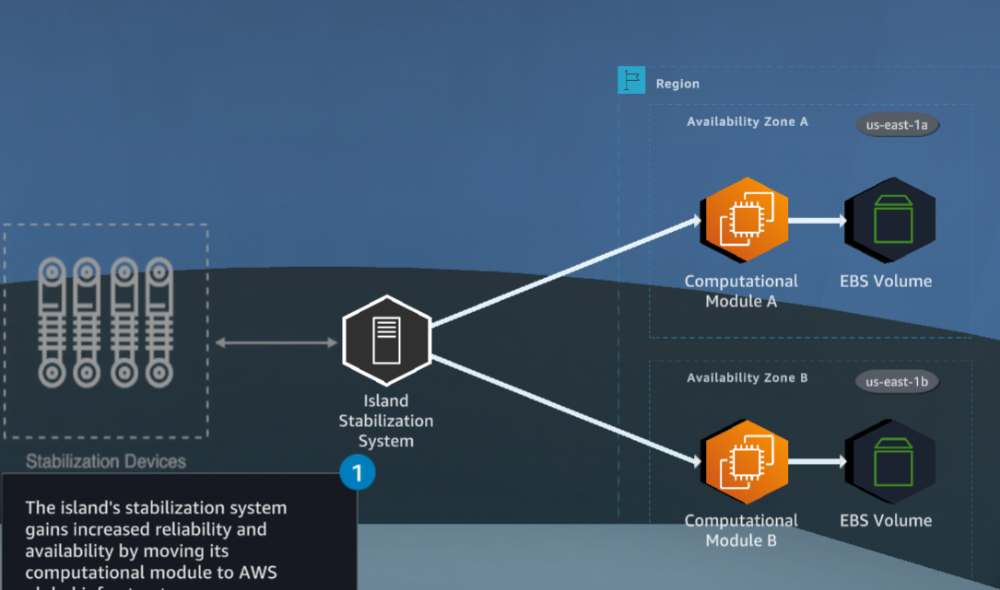

# CloudQuest

## Cloud COmputing Essentials

- Cloud computing on AWS provides access to technology services like compute, power, storage, and databases.
- Resources are available on demand
- You only pay for what you use
- Can deploy a server in minutes
- Fraction of the cost of traditional servers

## Static webpage hosting on S3

- Each day a file with the hourly wave size prediction is sent to the island IT department
- Visiting the web portal triggers a get request to waves.html page hosted on S3 that displays forecast data

### S3 Overview

- Object Storage service
- Object
  - Data
  - Metadata
- Bucket - stoarage space
- Scalability
- Availability
- Security
- Performance
- Website
- Mobile
- Enterprice
- Backup
- Restore
- Fluctuating demands
- 11 9s durability
- Security
- Audit capabilities
- Encryption features
- Access management tools
- Block public access
- PCI-DSS |HIPPA/HITECH | RedRAMP | Fisma
- Most supported cloud storage network
- Amazon Partner Network
  - Migration partners
  - Storage partners
    - Archive / Restore / Disaster
  - AWS Marketplace

### S3 MOre Features

- S3 Standard -msec
- Intelligent-Tiering -msec
- Standard-IA -msec
- One Zone - IS -msec
- Glacier Instant -msec cheapest immediate
- Glacier Flexible -mins / 5-12H
- Glacier Deep Archive -12-48H
- Management tools for granular data control
- S3 Storage Class Analysis - find lowest cost storage based on access patterns
- CRR - Cross Region Replication - or within region
- Object Lock - retention period
- Inventory - list encryption status
- API requests
- Works with Lambda
  - Activities
  - Alerts
  - Automate workflows
- Big Data Analytics - directly on data stored in S3 without copying or moving
- Compatible with Athena and Redshift Spectrum
  - Run SQL queries against data at rest in S3
- s3 Select - subsets of data - increase query performance and reduce costs
- Versioning
  - Unversioned (default)
  - Enabled
  - Suspended
  - Recover objects from accidental deletion or overwrite
  - Delete marker
  - Can restore previous version

### S3 Access management

- By default, all S3 resources are private
- Owner can grant access permissions to others
- Access policies
  - Resource based
    - Access control list for each bucket and object
    - Bucket policies (JSON)
    - Granted to owner by default
  - User policies
    - Attached to users
    - IAM Users, groups, roles

### S3 Performance

- Industry leading performance
- Parallel requests
- Scalable
  - Scales per prefix
  - Supports folder concept for grouping
  - 3500 requests oer second - put/copy/post/delete
  - 5500 get/head requests
- Consistency
  - Strong read after write consistency
  - No impace on performance or availability
  - By default
  - Simplicity
  - Great for Data Lakes
  - Access most recent data immediately after a write

## Types of cloud computing models

### Infrastructure as a Service (Iaas)

- Storage
- Compute
- Networking
- OS
- Simple provisioning ana management
- Convenient

### Platform as a Service (Paas)

- No longer need to manage underlying infrastructure
- No Capacity planning
- No Software maintenance
- No Resource procurement
- No patching
- Run containers without having to manage servers and clusters
- No provisioning or managing servers
- Services takes care of everything to scale and run code

### Software as a Service (SaaS)

- Application provided
- Web-based email
- Service and underlying platform are managed and maintained

- Convenience increases
- Control decreases

## Cloud Computing Deployment Models

### On Premesis

- Legacy IT infrastucture
- Physical Servers
- Databases
- Storage

### Hybrid

- Mixture of cloud and on-premesis
- On prem
  - Latency
  - Control
  - Sensitive dta
- Cloud
  - Extend existing infrastructure

---

## Practice Lab I

- [ ] Create S3 Bucket
- [ ] Configure for web hosting
- [ ] Upload files

### Cloud

- Migrated from existing infrastuctures
- Scalable virtual servers
- Everything runs in the cloud

---

## EC2

- Elastic Compute Cloud
- Web service that provides reliable, scalable compute capacity in the cloud
- Launch virtual servers in minutes
- Can be put in two AZs
  - Logical data center in an AWS region
  - Redundant and separate power, networking, and connectivity
  - Each AZ is supported by one or more physical data centers
- Very reliable

### Diagram Steps

1. Move island stabilization center module to EC2
2. Instance provides compute capacity in the cloud
3. Deployed to two AZs
4. Elastic Block Store (EBS) - easy to use, high performance, block storage with EC2

### Videos

#### AWS Global Infrastructure Overview

- Cloud infrastructure companies can depend on no matter their size, needs
- Flexible, reliable, scalable, secure, global
- Rapidly expand operations to any region or country
- Many regions
  - Multiple AZs
- Largest global footprint of any provider
- Committed to sustainability
- Cloud Computing in Regions
  - Separate Geographic areas
  - At least 2 AZs
  - ost have 3
  - Up to 6
  - Fully isolated for redundancy
  - At least one Data center - usually 3
  - Separate facilities
  - Redundant power
  - Highly available, low-latency 100GbE metro Fiber network
  - CloudFront - Global Content Delivery Network (CDN)
  - PoP location - edge sites
  - Lightning, tornados, earthquakes, etc
  - Load balancer distributes traffic across AZs

#### Global Infrastructure Benefits

- Performance
  - High quality
  - Uninterrupted
  - Highly available, low latency, secure
  - AZs physical redundancy
    - Resilient
    - No single point of failure
    - Redundant
    - Custom hardware
      - Compute servers
      - Load Balancers
      - Routers
      - Silicon
- Security
  - Military
  - Global banks
  - 24/7 montoring
- Scalability
  - Extremely flexible
  - Infinite
  - Provision what you need and scala up or down
  - Spin up resources as you need them
    - Thousands of servers in minutes
- Low costs
  - Economics of Scale

#### EC2 II

- Elastic Compute Cloud
- Web service
- Secure, resizable compute capacity
- No upfront hardware investment
- Virtual servers
- Scale up or down
- No need to forecast traffic
- Complete control
- Reliable scale compute
- Multiple locations worldwide
- Secure
- Instance
  - Virtual server in the cloud
  - Many types
  - CPU, memory, storage, and networking
  - General Purpose
    - Balanced resources
  - Compute Optimized
  - Memory Optimized
    - Process large datasets
    - Big Data Analytics
  - Storage Optimized
    - Sequential read and write
  - Accelerates
    - GPU hardware accelerators
- AMI
  - Image
  - OS, applications, application server
  - Can launch one or more instances

##### Storage Networking

- Flexible, cost-effective, easy to use
- Inastance store - attached
- Elastic Block Store (EPB) for persistent storage
  - EBS Snapshots
- S3
  - Store AMIs
- Elastic File System (EFS)
- Virtual Private Cloud
  - Virtual Network
  - Can span multiple AZs for fault tolerance
  - Multiple layers of security
    - Security group - virtual firewall
- Determine single or multiple locations
- Select Amazon Machine Iage
- Determine instance type and sizes
- Configure network access
- Attach storage
- Add tags
  - Categorize
  - Search
  - Managee
- Security Groups
  - Key pairs
- Launch as many or few instances as you need in minutes

##### EBS Overview

- Service providing block level storage volumes for use with EC2
- Raw, unformatted, external block device
- Mounted to EC2 instance
- Single-millisecond latency
- Data persistence
  - Available after stop or terminate instance
- SSD-backed storage - frequent read-write with small I/O
  - Database
  - Boot volumes
  - Highest performance for low-latency operation
- HDD
  - Throughput intensive
    - Map Reduce
    - Data warehouse
    - Log processing
    - Throughput Optimized
    - Cold HDD

##### EBS Features

- Elastic volumes
  - Dynamic increase capacity
  - Tune performance
  - Change volume types
  - No downtime or performance impact
  - Can use CloudWatch and Lambda to automate volume changes
  - Dedicated throughput from EC2 to EBS
  - Minimizes contention for best performance
- Snapshots
  - Backup to S3 for disaster recovery
  - Incremental backups
  - One or multiple EBS volumes based on snapshots
  - DIrect read access
  - EBS direct API
  - Track incremental changes
  - Create EBS snapshots from any block storage
    - Including on premesis
  - Attached instance has immediate access
  - Fast Snapshot Restore (FRS)
  - Can be shared across accounts and copied across regions
- Data Lifecycle Manager
  - Custom schedule and cleanup
  - Lifecycle policies for creation sna management
  - CloudWatch Events tracks
- Multi-attach
  - One provisioned SSD can attached to 16 EC2 instances

##### EBS Benefits

- Performance for any workload
- Performant for most demanding
  - SAP
  - Oracle
  - Mictosoft
  - Relational
  - Non-relational
  - Enterprise
  - Containerized
  - Big data engines
- Highly available and durable
  - Automatically replicated within AZ
  - High durability 5 9s
- Amazon Lifecycle manager (DLM)
- Cost effective
  - Many options to balance needs and costs
  - Precise level for needs
  - Billed incrementally
- Easy to use
  - Easy to create
  - Use
  - Encrypt
  - Protect
  - Scale as needs change
  - Backup EBS snapshot
  - Automate DLM
- Virtually unlimited scale GB - PBs
- Secure
  - IAM
  - Compliance
  - Encrypted by default
  - Encrypt data at rest, data in transit, and all backups
  - Built-in Key management system

##### EBS Volume Types

- General Purpose SSD
  - gp3
    - Performance independent od storage
    - 1000 MB/s
    - 1 GB - 16 TB
  - gp2
    - 250 MB/s
    - 1 GB - 16 TB
  - io1
    - 99.9
    - 4-16 TB
  - io2
    - 99.999
    - 4-16 TB
  - Throughput Optimized
    - st1
    - sc1 
